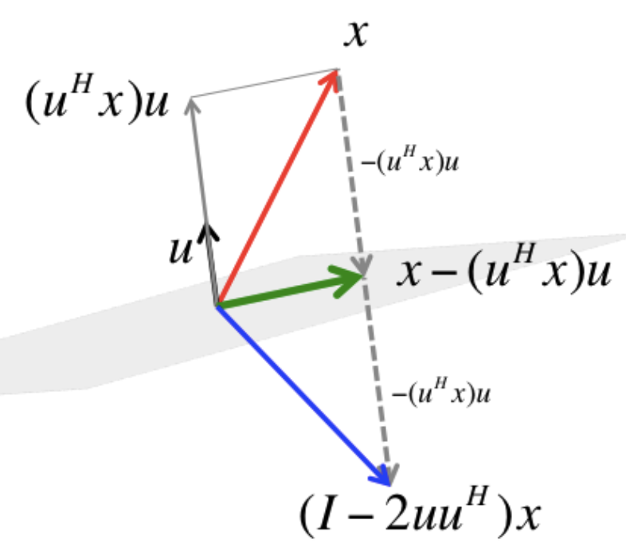



# Matrices de Householder

## Proyector $v\trans{v}$

Sea $v \in \reals^n$ con $\norm{v}=1$, la expresión $v\trans{v}$ produce una matriz de rango 1. Nos preguntamos: ¿qué hace esta matriz cuando se aplica a otro vector $u$? Es decir, ¿quién es $v\trans{v} u$?

Aplicando asociatividad, podemos ver que $v\trans{v} u = v(\trans{v} u) = \inner{v}{u}v$, es decir, el resultado es un vector en la dirección de $v$ y de módulo $\norm{u}|\cos\theta|$. Es decir, es la proyección ortogonal de $u$ en la dirección de $v$:

$$u_v = v\trans{v} u$$

Por comodidad, normalmente tomamos $v$ unitario. Si $v$ no fuera unitario, el proyector correcto sería:
$$\frac{v\trans{v}}{\trans{v} v}$$
(hay que normalizarlo). El concepto de proyectar sobre la dirección de $v$ (es decir, quedarse únicamente con la componente paralela a $v$) sigue siendo el mismo.

**La expresión $v\trans{v}$ es un proyector sobre la dirección de $v$.**

## Proyección sobre $v^\perp$

Si restamos a $u$ su componente en la dirección de $v$, esto "colapsa" el vector $u$ sobre el hiperplano ortogonal a $v$.

$$u_{v^\perp} = (\identity - v\trans{v})u$$

## Reflexión

Si en cambio restamos la componente de $u$ en la dirección de $v$ **dos veces**, obligamos al vector a cruzar el hiperplano y quedar exactamente a la misma distancia en el lado opuesto. A esta transformación se le llama **Reflexión de Householder**.

### Definición
Dado un vector $v \in \reals^n$ unitario ($\norm{v}=1$), la matriz de Householder se define como:
$$H = \identity - 2v\trans{v}$$
La matriz $H$ actúa como un operador de reflexión:

- Si un vector $x$ es ortogonal a $v$, entonces $Hx = x$ (el vector reside en el hiperplano de reflexión).
- Si un vector $x$ es paralelo a $v$, entonces $Hx = -x$ (se refleja completamente en la dirección opuesta).

::: {#fig-householder}
{height="300"}

Reflexión $Hx$ de $x$ a través de $v^\perp$\
Créditos: Robert van de Geijn y Margaret Myers.
Fuente: [LAFF-ALAF](https://www.cs.utexas.edu/~flame/laff/alaff/chapter03-householder-transformation.html)
:::

### Propiedades Estructurales

La potencia de Householder en el cálculo numérico reside en sus propiedades estructurales:

Simetría
: La matriz es idéntica a su traspuesta.
$H^\top = (I - 2vv^\top)^\top = \identity^\top - 2(v^\top)^\top v^\top = \identity - 2vv^\top = H$

Involución
: Aplicar la reflexión dos veces regresa el espacio a su estado original:
$H^2 = (\identity - 2vv^\top)(\identity - 2vv^\top) = \identity - 4vv^\top + 4v(v^\top v)v^\top$
Como $\trans{v} v = 1$, la expresión se simplifica a $\identity - 4v\trans{v} + 4v\trans{v} = \identity$. Por lo tanto, $H^2 = \identity$.

Ortogonalidad
: Sabemos que es simétrica ($H^\top = H$) e involutiva ($H^2 = \identity$). Por lo tanto, $H^\top H = H H = H^2 = \identity$, lo que demuestra que es ortogonal y que $\inv{H} = H^\top = H$.

Isometría
: Como es ortogonal, preserva la norma del vector original y nunca amplifica el error numérico: $\norm{Hu} = \norm{u}$.

### Espectro y Autovectores

La matriz de Householder tiene un espectro extremadamente simple, compuesto únicamente por los autovalores $\lambda_1=1$ y $\lambda_2=-1$.

Autovalor $\lambda_2=-1$
: El vector unitario $v$ que define la reflexión es el autovector asociado a $-1$. Esto se debe a que la matriz actúa invirtiendo su dirección:
$$Hv = (\identity - 2v\trans{v})v = v - 2v(\trans{v}v) = v - 2v = -v$$

Autovalor $\lambda_1=1$
: El hiperplano ortogonal a $v$, denotado como $v^\perp$, es el espacio propio asociado al autovalor $\lambda_1=1$. Cualquier vector $w$ contenido en este plano satisface $Hw=w$, lo que significa que el autovalor $1$ tiene una multiplicidad de $n-1$.

Desde una perspectiva geométrica, esto confirma que la matriz es una reflexión: los vectores sobre el "espejo" $v^\perp$ no cambian, mientras que el vector normal al espejo ($v$) se refleja exactamente en la dirección opuesta.

Como consecuencia de este espectro, el determinante de cualquier matriz de Householder es siempre $-1$.

### Utilidad en Factorizaciones
En la práctica, utilizamos Householder para "limpiar" columnas de una matriz. Si queremos que un vector $x$ se convierta en un vector con ceros en todas las posiciones excepto la primera (es decir, reflejarlo sobre la dirección del eje $e_1$), diseñamos un espejo que esté justo a mitad de camino entre $x$ y el eje deseado. 
La "limpieza" de una columna mediante una reflexión de Householder consiste en diseñar un hiperplano (espejo) que sea el bisector perpendicular del camino entre el vector original $x$ y el objetivo deseado $z$ [@alnae Clase 6; @lecture Lec. 3].

Generalmente se busca que toda la norma del vector $x$ se concentre en la primera componente para crear ceros debajo. Por tanto, el objetivo es $z = \pm \norm{x}e_1$.

#### Prevención de la Cancelación Catastrófica
Para que la transformación sea numéricamente estable y evitar la sustracción de dos números muy cercanos (cancelación catastrófica), debemos elegir el signo de $z$ de modo que sea opuesto al signo de la primera componente de $x$ ($x_1$):
$$z = -\operatorname{sgn}(x_1) \norm{x} e_1$$
donde definimos $\operatorname{sgn}(x_1) = 1$ si $x_1 \ge 0$ y $-1$ en caso contrario.

El vector perpendicular al espejo es la línea que conecta ambos puntos: $v = x - z$. Con esta elección de signo, la primera componente de $v$ es:
$$v_1 = x_1 + \operatorname{sgn}(x_1) \norm{x}$$
lo que asegura que no ocurra una resta de términos de magnitudes similares, eliminando el riesgo de inestabilidad numérica.

Para asegurar que la matriz de reflexión sea ortogonal, se utiliza el vector unitario $u = \frac{v}{\norm{v}}$. La matriz resultante $H = \identity - 2u\trans{u}$ actúa sobre $x$ de la siguiente manera:
$$Hx = (\identity - 2u\trans{u})x = x - 2u(\trans{u} x)$$

Esto cancela la componente de $x$ paralela a $u$ y refleja la columna exactamente sobre el objetivo $z$, dejándola "limpia" con ceros debajo de la primera posición.
