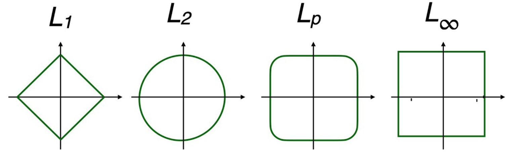



En el universo del álgebra lineal contemporánea, medir la magnitud de los objetos estructurados exige trascender la intuición geométrica clásica de la recta real. Al adentrarnos en espacios multidimensionales, las normas vectoriales emergen no solo como herramientas analíticas para definir distancias y esculpir nuevas geometrías, sino como el lenguaje fundamental para cuantificar el error y garantizar la convergencia algorítmica.

# Normas

## Definición

Una norma es una función que asigna un número real no negativo a un objeto $v$ para cuantificar su magnitud. Para que una medida sea considerada matemáticamente una norma, debe cumplir con tres propiedades fundamentales: [@lecture Lec. 8; @strang I.11]

Positividad
: $\norm{v}>=0, \quad \norm{v} = 0 \implies v=0$

Homogeneidad
: $\norm{cv} = |c| \cdot \norm{v}$

Desigualdad del triángulo
: $\norm{v+w} \le \norm{v} + \norm{w}$

### La Identidad de Polarización y la Ley del Paralelogramo

La **Identidad de Polarización** es un resultado fundamental que establece un vínculo directo entre el producto interno de un espacio y la norma que este induce [@practico Pr5 Ej4]. Mientras que una norma nos dice qué tan "largo" es un vector, el producto interno nos da información sobre la relación angular entre dos vectores; esta identidad demuestra que, bajo ciertas condiciones, el producto interno puede recuperarse por completo conociendo solo las magnitudes [@practico Pr5 Ej4].

La identidad se deriva expandiendo la norma al cuadrado de la suma (o resta) de dos vectores utilizando las propiedades del producto interno [@practico Pr5 Ej4]:

$$
\begin{aligned}
& \|v + w\|^2 = \langle v+w, v+w \rangle = \|v\|^2 + \|w\|^2 + 2\langle v, w \rangle \\
& \|v - w\|^2 = \langle v-w, v-w \rangle = \|v\|^2 + \|w\|^2 - 2\langle v, w \rangle
\end{aligned}
$$ {#eq-deduccion-polarizacion}

Al despejar el producto interno de la primer ecuación, obtenemos la primera forma de la identidad [@practico Pr5 Ej4]:

$$\inner{v}{w} = \frac{1}{2} (\norm{v + w}^2 - \norm{v}^2 - \norm{w}^2)$$

Si en cambio restamos ambas ecuaciones [-@eq-deduccion-polarizacion], llegamos a la forma más utilizada [@practico Pr5 Ej4]:
$$\inner{v}{w} = \frac{1}{4} \left( \norm{v + w}^2 - \norm{v - w}^2 \right)$$ {#eq-ley-polarizacion}

Si en lugar de sumar las ecuaciones, las restamos, obtenemos una regla equivalente para normas inducidas: la **Ley del Paralelogramo**. Geométricamente, establece que en un paralelogramo, la suma de los cuadrados de las longitudes de las diagonales es igual a la suma de los cuadrados de las longitudes de los cuatro lados [@practico Pr5 Ej4].

$$ \|v+w\|^2 + \|v-w\|^2 = 2\|v\|^2 + 2\|w\|^2 $$ {#eq-ley-paralelogramo}

### Normas Inducidas por Producto Interno

Una norma es **inducida por un producto interno** si existe una función $\inner{v}{w}$ tal que $\norm{v} = \sqrt{ \inner{v}{v} }$.

Estas normas son las únicas que satisfacen la Identidad de Polarización [@practico Pr5 Ej4, @practico Pr5 Ej6].

Si una norma no cumple esta igualdad (como la norma $\ell_1$ o $\ell_\infty$), no puede provenir de un producto interno y, por lo tanto, no define una noción de "ángulo" o "proyección ortogonal" en el sentido euclidiano habitual.

Esta propiedad es la que permite que espacios como el de las matrices con la norma de Frobenius se consideren **Espacios de Hilbert**. Gracias a la polarización, podemos hablar de "ángulos" u "ortogonalidad" entre matrices utilizando el producto interno de Hilbert-Schmidt.

## Normas Vectoriales

Las normas más utilizadas en el análisis de datos pertenecen a la familia $\ell_p$

$$\norm{v}_p = \left( \sum_{i=1}^{n} |v_i|^p \right)^{1/p}$$

Dentro de esta familia, destacan cuatro casos fundamentales:

Norma $\ell_2$ (Euclidiana)
: Representa la distancia más corta entre dos puntos. Es la única norma de esta familia inducida por el producto punto estándar $v^\top v$.
$$||v||_2 = \sqrt{\sum_{i=1}^{n} v_i^2} = (v_1^2 + v_2^2 + \dots + v_n^2)^{\half}$$

Norma $\ell_1$ (Manhattan)
: Se define como la suma de las magnitudes absolutas. [^norma-manhattan-aplicacion].
$$||v||_1 = \sum_{i=1}^{n} |v_i| = |v_1| + |v_2| + \dots + |v_n|$$

Norma $\ell_\infty$ (Máximo)
: Resulta de llevar $p$ al infinito, lo que hace que el componente de mayor magnitud domine sobre los demás.
$$||v||_\infty = \max_{1 \le i \le n} |v_i|$$

[^norma-manhattan-aplicacion]: Su minimización es el motor del *compressed sensing*, pues tiende a producir soluciones ralas (con componentes nulos)

### Geometría de las Normas

La geometría de una norma se visualiza a través de su "bola unitaria" (el conjunto de vectores con norma igual a 1). La forma de esta bola determina el comportamiento en problemas de optimización:

La geometría de una norma se visualiza a través de su "bola unitaria", definida como el conjunto de vectores con norma igual a 1.
$$\mathcal{B} = \{v \in \mathbb{R}^n : \norm{v}_p \le 1\}$$
La forma de esta bola determina cómo la norma penaliza las componentes del vector y es crucial en problemas de optimización con restricciones. A medida que el parámetro $p$ varía, la forma de la bola unitaria experimenta una transformación geométrica continua:

Norma $\ell_1$ (Diamante)
: En $\mathbb{R}^2$, la bola es un diamante con vértices en los ejes $(\pm 1, 0)$ y $(0, \pm 1)$. Geométricamente, los vértices "puntiagudos" en los ejes explican por qué la minimización de $\norm{v}_1$ bajo restricciones lineales tiende a encontrar soluciones dispersas (*sparse*), ya que es más probable que la restricción toque primero un vértice.

Norma $\ell_2$ (Círculo/Esfera)
: Representa el caso clásico donde la bola es un círculo perfecto. No favorece ninguna dirección en particular, lo que resulta en soluciones donde muchas componentes son pequeñas pero no nulas.

Norma $\ell_\infty$ (Cuadrado/Cubo)
: La bola unitaria es un cuadrado con lados paralelos a los ejes, definidos por las rectas $x = \pm 1$ y $y = \pm 1$. En este caso, el tamaño del vector solo depende de su componente más grande.

Familia $\ell_p$ Genérica
: Para $1 < p < 2$, la bola es una forma intermedia entre el diamante y el círculo. Para $p > 2$, la bola se "infla" hacia el cuadrado (*squircle*). Una propiedad crítica es que para cualquier $p \ge 1$, la bola unitaria es un **conjunto convexo**, lo que garantiza que cualquier mínimo local en un problema de optimización sea también un mínimo global. Las normas verdaderas siempre definen conjuntos convexos. Cuando $p < 1$, la medida pierde la convexidad y deja de ser una norma válida.

::: {#fig-lp-norm}
{width="500"}

Familia de normas Lp  
Fuente: [Dr Will Wood](https://www.youtube.com/watch?v=NKuLYRui-NU)
:::

### El Caso Especial de $\ell_0$

Aunque se le llama norma $\ell_0$ en la práctica, formalmente no es una norma por incumplir la homogeneidad escalar. Representa la cantidad de elementos distintos de cero en el vector.
$$||v||_0 = \#\{i : v_i \neq 0\}$$

Tiene una geometría degenerada. Su "bola unitaria" no abarca un área, sino que consiste únicamente en los ejes coordenados (donde solo una componente es no nula). Al no ser un conjunto convexo (y no cumplir con la homogeneidad escalar), $\ell_0$ no es una norma verdadera. De forma general, la desigualdad triangular falla cuando $p<1$ [^norma-0-convexidad].

[^norma-0-convexidad]: Minimizar $\norm{v}_0$ es un problema de combinatoria NP-duro. La importancia de la norma $\ell_1$ radica en que es la "envoltura convexa" de $\ell_0$, lo que permite resolver problemas de dispersión mediante técnicas de optimización convexa eficientes [@strang I.11].

### Normas $S$

La norma $S$, frecuentemente denominada norma de energía, permite adaptar la medición de magnitud a la estructura de un problema específico mediante una matriz simétrica definida positiva $S$.

Para un vector $v$, la norma $S$ se define como:
$$\norm{v}_S = \sqrt{v^\top S v}$$

Para que esta expresión satisfaga formalmente los axiomas de una norma, especialmente la positividad ($\norm{v} > 0$ para $v \neq 0$), la matriz $S$ debe ser estrictamente definida positiva. Si $S$ es la matriz identidad ($I$), la norma $S$ colapsa a la norma euclidiana estándar $\ell_2$.

#### Interpretación Geométrica

A diferencia de la norma $\ell_2$, cuya bola unitaria es una esfera perfecta, la bola unitaria de la norma $S$ (definida por el conjunto $\{v : v^\top S v \le 1\}$) describe un elipsoide en $\mathbb{R}^n$. 

Las direcciones de los ejes de este elipsoide coinciden con los vectores propios $q_i$ de la matriz $S$. La extensión del elipsoide en cada dirección es inversamente proporcional a la raíz cuadrada del valor propio correspondiente, siendo la longitud del $i$-ésimo semieje igual a $1/\sqrt{\lambda_i}$. [^norma-S-aplicacion]

[^norma-S-aplicacion]: Esta norma es fundamental en algoritmos de optimización y aprendizaje profundo, donde se utiliza para definir funciones de pérdida que penalizan de manera distinta diferentes direcciones del espacio de parámetros.

## Normas en Espacios de Funciones

La generalización del concepto de norma permite medir la magnitud no solo de vectores discretos, sino también de objetos continuos como las funciones. Esta transición es fundamental para el análisis funcional y el procesamiento de señales [@lecture Lec. 8].

### Norma $L^p$ Funcional
En un espacio de funciones definidas sobre un intervalo $[a, b]$, la norma $L^p$ sustituye la sumatoria por una integral de la magnitud de la función elevada a la potencia $p$ [@practico Pr1 Ej11]:

$$\norm{f}_p = \left( \int_a^b |f(x)|^p dx \right)^{1/p}$$

#### La Norma $L^2$ y la Energía
La norma más utilizada es la **norma $L^2$**, también conocida como la norma de energía de la función. Al igual que en el caso vectorial, es la única de la familia $L^p$ que es inducida por un producto interno [@lecture Lec. 8; @alnae Clase 15]:

$$\langle f, g \rangle = \int_a^b f(x)g(x) \, dx \implies \norm{f}_2 = \sqrt{\int_a^b |f(x)|^2 \, dx}$$

Esta estructura convierte al conjunto de funciones de cuadrado integrable en un **Espacio de Hilbert**, permitiendo extender conceptos geométricos como la ortogonalidad. Por ejemplo, las funciones seno y coseno son ortogonales bajo este producto interno, lo que constituye la base de las series de Fourier.

## Cauchy - Schwarz

La desigualdad de Cauchy-Schwarz establece un límite superior estricto para el producto interno de dos vectores en términos del producto de sus normas [@practico Pr3 Ej2; @practico Pr5 Ej2; @lecture Lec. 4, @lecture Lec. 3, @practico Pr5 Ej2; @alnae Clase 17].

$$\forall\ v,w \in \realsn \quad |v^\top w| \le \norm{v}_2 \norm{w}_2$$

La importancia de esta relación radica en los extremos de su cumplimiento:

Igualdad ($|v^\top w| = \norm{v}_2 \norm{w}_2$)
: Ocurre si y solo si los vectores son linealmente dependientes (colineales), es decir, $v=\alpha w$ para algún escalar $α$.

Ortogonalidad ($\trans{v}w=0$)
: Representa el límite inferior del valor absoluto, donde los vectores son perpendiculares y no comparten ninguna dirección común.

Esta desigualdad garantiza que la noción geométrica del coseno de un ángulo ($\cos \theta = \frac{v^\top w}{\norm{v}\norm{w}}$) siempre esté bien definida dentro del intervalo [−1,1], permitiendo que la geometría euclidiana sea consistente en cualquier número de dimensiones.

### Deducción Algebraica y Geométrica

Para deducir la desigualdad, consideramos la proyección ortogonal de un vector $v$ sobre la dirección de un vector $w$. Definimos el vector de proyección $p$ como [@alnae Clase 5, @lecture Lec. 9]:
$$p = \frac{v^\top w}{\norm{w}_2^2} w$$

El residuo o error de esta aproximación es el vector $e = v - p$, el cual es, por construcción, perpendicular a $w$.

Dado que la norma al cuadrado de cualquier vector debe ser mayor o igual a cero, aplicamos esta propiedad al vector de error $e$:
$$0 \le \norm{e}_2^2 = \langle v - p, v - p \rangle$$

Al expandir el producto interno y sustituir la definición de $p$, obtenemos:
$$0 \le v^\top v - \frac{(v^\top w)^2}{w^\top w}$$

Reorganizando los términos, llegamos a la forma cuadrática de la desigualdad:
$$(v^\top w)^2 \le (v^\top v)(w^\top w)$$

Al extraer la raíz cuadrada en ambos lados, se obtiene el enunciado clásico: $|v^\top w| \le \norm{v}_2 \norm{w}_2$.

#### Significado Geométrico
Esta deducción revela que la desigualdad es en realidad una afirmación sobre la "sombra" de un vector: el producto interno (la proyección escalonada) nunca puede superar el producto de las longitudes totales de los vectores originales. El residuo $e$ mide qué tan lejos están los vectores de ser perfectamente colineales; cuando el residuo es cero, se alcanza la igualdad perfecta [@practico Pr3 Ej2].

## Desigualdad Triangular

La desigualdad de Cauchy-Schwarz es el eslabón matemático que permite validar a la norma euclidiana como una métrica legítima, pues sin ella no sería posible demostrar la **desigualdad triangular**. Esta propiedad es uno de los tres requisitos fundamentales para que una función sea considerada una norma: establece que el camino directo entre dos puntos es siempre menor o igual a la suma de los tramos de cualquier camino indirecto [@lecture Lec. 7; @practico Pr1 Ej4; @practico Pr5 Ej2, @practico Pr5 Ej4].

$$\norm{v + w}_2 \le \norm{v}_2 + \norm{w}_2$$

Para demostrarlo, partimos del cuadrado de la norma de la suma, expandiéndola mediante el producto interno:

$$\norm{v + w}_2^2 = \langle v + w, v + w \rangle = \norm{v}_2^2 + \norm{w}_2^2 + 2\langle v, w \rangle$$
En este punto, la desigualdad de Cauchy-Schwarz nos permite acotar el término del producto interno: $2\langle v, w \rangle \le 2|\langle v, w \rangle| \le 2\norm{v}_2\norm{w}_2$.

$$\norm{v + w}_2^2 \le \norm{v}_2^2 + \norm{w}_2^2 + 2\norm{v}_2\norm{w}_2$$

Observamos que el lado derecho es un cuadrado perfecto:
$$\norm{v + w}_2^2 \le (\norm{v}_2 + \norm{w}_2)^2$$
Al extraer la raíz cuadrada, obtenemos la desigualdad triangular.

#### Consecuencias en el Espacio Vectorial
Sin Cauchy-Schwarz, la geometría del espacio $\mathbb{R}^n$ colapsaría. Esta relación garantiza que:

*   **La noción de distancia sea coherente:** Asegura que las longitudes medidas por la norma $L_2$ se comporten según nuestra intuición física en cualquier dimensión.
*   **Convexidad del conjunto unitario:** La desigualdad triangular implica que el conjunto de vectores con norma menor o igual a 1 es **convexo** (un círculo, esfera o hiper-esfera), lo cual es crítico para los algoritmos de optimización que buscan mínimos globales.
*   **Consistencia con ángulos:** Permite que la definición del coseno entre dos vectores esté siempre entre -1 y 1, vinculando finalmente la magnitud con la dirección.

