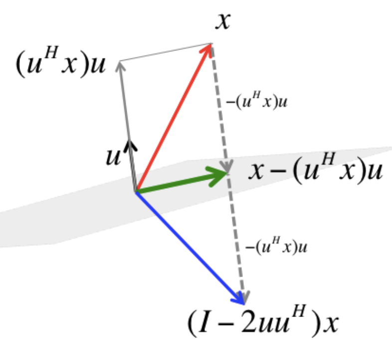

# Matrices de Householder

## Proyector $vv^\top$

Sea $v \in \mathbb{R}^n, \|v\|=1$, la expresión $vv^\top$ produce una matriz de rango 1. Nos preguntamos, que hace esta matriz, cuando se la aplico a otro vector $u$. Es decir, quien es $vv^\top u$ ?

Aplicando asociatividad, podemos ver que $vv^\top u = v(v^\top u) = v\langle v,u\rangle$, es decir que el resultado, es un vector en la direccion de $v$, y de módulo $\|u\|cos\theta$. Es decir, es la proyección de $u$ en la dirección de $v$:

$u_v=vv^\top u$

Si $v$ no fuese unitario, el proyector correcto seria $\frac{vv^\top}{v^\top v}$ (hay que normalizarlo). Pero el concepto de "quitar una dimensión" para colapsar sobre la dirección de $v$ sigue siendo el mismo.

**La expresión $vv^\top$ es un proyector sobre la dirección de $v$**

## Proyeccion sobre $v^\perp$

Si restamos a $u$ la componente de $u$ en la dirección de $v$, esto "colapsa" el vector $u$ sobre el plano ortogonal a $v$.

$$u_{v^\perp} = (\mathbb{I} - vv^\top)u$$

## Reflexión

Si en cambio restamos la componente de $u$ en la dirección de $v$ **dos veces**, obligamos al vector a cruzar el eje y quedar exactamente a la misma distancia en el lado opuesto. A esta transformacion se le llama **Matriz de Householder**.

Una **Matriz de Householder** $H$ es un tipo especial de matriz ortogonal y simétrica que se utiliza para reflejar vectores respecto a un hiperplano.

### Definición
Dado un vector $v \in \mathbb{R}^n$ unitario ($\|v\|=1$), la matriz de Householder se define como:
$$H = \mathbb{I} - 2vv^\top$$
La matriz $H$ actúa como un operador de reflexión:

- Si un vector $x$ es ortogonal a $v$, entonces $Hx = x$ (el vector reside en el hiperplano de reflexión).
- Si un vector es paralelo a $v$, entonces $Hv = -v$ (el vector se refleja completamente).

::: {#fig-householder}
{height="300"}

Reflexión $Hx$ de $x$ a travez de $u^\perp$\
Créditos: Robert van de Geijn y Margaret Myers.
Fuente: [LAFF-ALAF](https://www.cs.utexas.edu/~flame/laff/alaff/chapter03-householder-transformation.html)
:::

### Propiedades Estructurales

La potencia de Householder en el cálculo numérico reside en sus propiedades estructurales:

Simetría
: La matriz es idéntica a su traspuesta.
$H^\top = (I - 2vv^\top)^\top = \mathbb{I}^\top - 2(v^\top)^\top v^\top = \mathbb{I} - 2vv^\top = H$

Isometría
: Como es ortogonal, preserva la norma del vector original y nunca amplifica el error numérico. $\|Hu\| = \|u\|$.

Involución
: Aplicar la reflexión dos veces regresa el espacio a su estado original:
$H^2 = (\mathbb{I} - 2vv^\top)(\mathbb{I} - 2vv^\top) = \mathbb{I} - 4vv^\top + 4v(v^\top v)v^\top$
Como $v^\top v = 1$, la expresión se simplifica a $I - 4vv^\top + 4vv^\top = \mathbb{I}$. Por lo tanto: $H^2 = \mathbb{I}$.

Y uniendo con la simetría obtenemos tambien, $H^{-1} = H^\top$ y $H^2 = \mathbb{I}$.

### Utilidad en Factorizaciones
En la práctica, utilizamos Householder para "limpiar" columnas de una matriz. Si queremos que un vector $x$ se convierta en un vector con ceros en todas las posiciones excepto la primera (proyectarlo sobre el eje $e_1$), diseñamos un espejo que esté justo a mitad de camino entre $x$ y el eje deseado. 
La "limpieza" de una columna mediante una reflexión de Householder consiste en diseñar un hiperplano (espejo) que sea el bisector perpendicular del camino entre el vector original $x$ y el objetivo deseado $z$ [@alnae clase 6; @lecture Lec. 3, '70].

Generalmente se busca que toda la norma del vector $x$ se concentre en la primera componente para crear ceros debajo. Por tanto, el objetivo es $z = \|x\|e_1$.
El vector perpendicular al espejo debe ser la línea que conecta ambos puntos: $v = x - z$. Este vector $v$ apunta directamente desde el origen del vector hacia su imagen reflejada.
Para asegurar que la matriz sea ortogonal, se utiliza el vector unitario $u = \frac{v}{\|v\|}$.
La matriz resultante $H = I - 2uu^\top$ funciona restando exactamente el doble de la proyección de $x$ sobre el vector normal $u$. Matemáticamente:
    $$Hx = (I - 2uu^\top)x = x - 2u(u^\top x)$$
Al aplicar $Hx$, la matriz resta exactamente el doble de la proyección de $x$ sobre el vector normal $u$. Esto cancela toda la parte de $x$ que "sobra" fuera del eje $e$ y lo empuja a aterrizar exactamente en el objetivo $z$, dejando la columna "limpia" con ceros debajo de la primera posición
